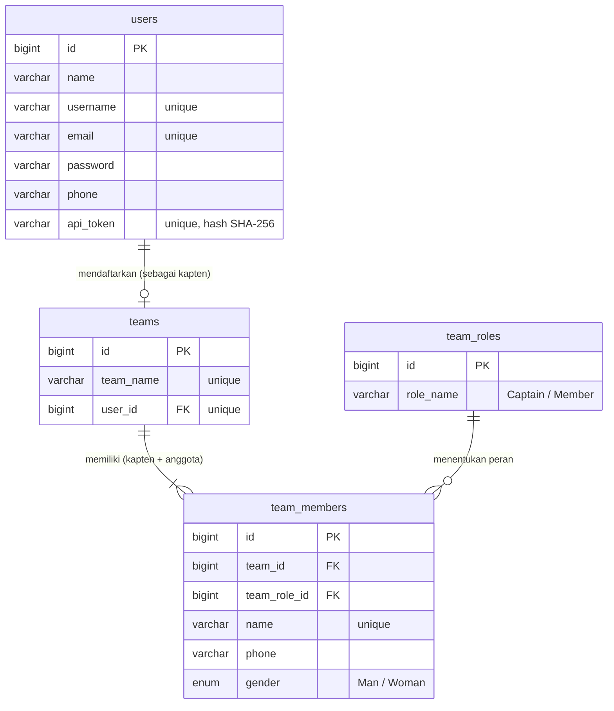

# Clavis Tournament Registration

Website pendaftaran turnamen game berbasis tim untuk **Web Developer Test Clavis**. Satu tim terdiri dari dua orang: kapten tim (pemilik akun yang mendaftarkan tim) dan satu anggota.

**Demo:** [https://taskfikri.infinityfree.io/login](https://taskfikri.infinityfree.io/login)

Di demo, buat akun baru lewat halaman **Daftar di sini**, lalu masuk dan daftarkan tim.

## Fitur

| Halaman | Aturan |
| --- | --- |
| **Login** | Username 6–15 karakter (hanya huruf dan angka), kata sandi 8–16 karakter, username harus terdaftar di database. Setelah valid, session dibuat dan user diarahkan ke pendaftaran tim. Tersedia "Ingat saya", dan login dikunci 60 detik setelah 5 kali gagal. |
| **Daftar akun** | Nama (huruf dan spasi), nama pengguna unik (huruf dan angka), email, kata sandi 8–16 karakter, nomor telepon (angka). |
| **Lupa kata sandi** | Tautan reset kata sandi dikirim ke email akun. |
| **Pendaftaran tim** | Hanya untuk user yang sudah login. Nama tim 4–15 karakter (huruf, angka, `_`) dan unik. Nama dan telepon kapten terisi otomatis dari session. Nama pemain hanya huruf dan spasi serta unik. Telepon 7–14 digit angka. Jenis kelamin `Man` atau `Woman`. Tersedia popup aturan & regulasi turnamen. |
| **Pendaftaran berhasil** | Menampilkan pesan selamat. User yang sudah mendaftarkan tim langsung diarahkan ke halaman ini setelah login, bukan ke form pendaftaran. |
| **Logout** | Keluar dan menghapus seluruh session. |

Semua validasi dijalankan di **server** (Form Request Laravel) dan di **client** (JavaScript), dengan pesan berbahasa Indonesia yang sama.

## Teknologi

- **Backend:** Laravel 13 (PHP 8.3+)
- **Database:** MySQL
- **Frontend:** Blade, Tailwind CSS 4, dan Vite; validasi client-side dengan JavaScript tanpa library
- **Testing:** Pest

## Struktur Database



- Satu akun hanya bisa mendaftarkan satu tim, dan pemilik akun menjadi kaptennya.
- Setiap tim berisi tepat dua pemain: satu `Captain` dan satu `Member`.
- Nama pemain unik di seluruh turnamen, sehingga satu orang hanya bisa terdaftar di satu tim.

## Menjalankan di Lokal

Kebutuhan: PHP 8.3+, Composer, Node.js, dan MySQL.

```bash
composer install
npm install
npm run build

cp .env.example .env
php artisan key:generate
```

Atur koneksi database di `.env`:

```env
DB_CONNECTION=mysql
DB_HOST=127.0.0.1
DB_PORT=3306
DB_DATABASE=clavis-test
DB_USERNAME=root
DB_PASSWORD=
```

Lalu jalankan migrasi dan server:

```bash
php artisan migrate
php artisan db:seed   # opsional: membuat akun demo
php artisan serve
```

Buka `http://127.0.0.1:8000`. Seeder membuat dua akun demo dengan kata sandi `password`:

- `testuser`: belum mendaftarkan tim
- `registered1`: sudah mendaftarkan tim `Demo_Team`

## REST API

Base URL: `/api/v1`. Autentikasi memakai **Bearer token** yang didapat dari endpoint login.

| Method | Endpoint | Token | Keterangan |
| --- | --- | --- | --- |
| `POST` | `/api/v1/register` | – | Membuat akun kandidat |
| `POST` | `/api/v1/login` | – | Menukar username dan kata sandi dengan Bearer token |
| `GET` | `/api/v1/candidate` | ✓ | Data detail kandidat beserta timnya (`team: null` jika belum mendaftar) |
| `POST` | `/api/v1/candidate/team` | ✓ | Mendaftarkan tim; kapten diambil dari akun pemilik token |
| `POST` | `/api/v1/logout` | ✓ | Mencabut token |

Kode status yang dipakai:

- `401`: token tidak ada atau tidak valid
- `409`: kandidat sudah pernah mendaftarkan tim
- `422`: validasi gagal

Contoh body `POST /api/v1/candidate/team`:

```json
{
    "team_name": "Garuda_01",
    "captain": { "gender": "Man" },
    "member": { "name": "Siti Aminah", "phone": "081298765432", "gender": "Woman" }
}
```

### Postman

Import [`Clavis-Tournament-API.postman_collection.json`](Clavis-Tournament-API.postman_collection.json) ke Postman, lalu sesuaikan variabel `base_url` (default `http://127.0.0.1:8000`). Setelah request **2. Login** dijalankan, token otomatis tersimpan dan dipakai oleh request lain.

> **Catatan:** hosting demo (InfinityFree) memasang proteksi anti-bot yang mewajibkan JavaScript dan cookie. Akibatnya, request dari Postman ke URL demo biasanya dibalas halaman HTML, bukan JSON. Jalankan API di lokal untuk mencoba koleksi Postman.

## Testing

```bash
php artisan test --compact
```

Test mencakup login, registrasi, reset kata sandi, pendaftaran tim (validasi, keamanan, dan redirect), serta seluruh endpoint REST API.
